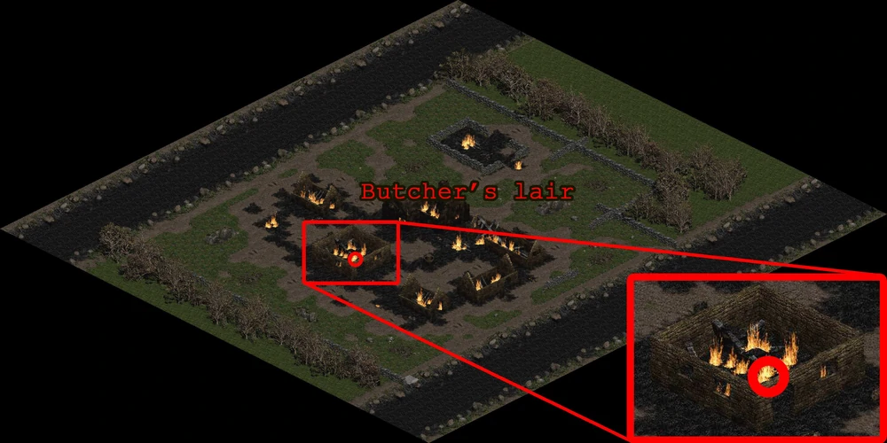
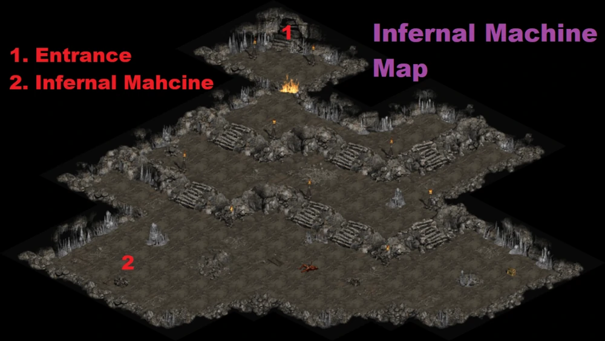
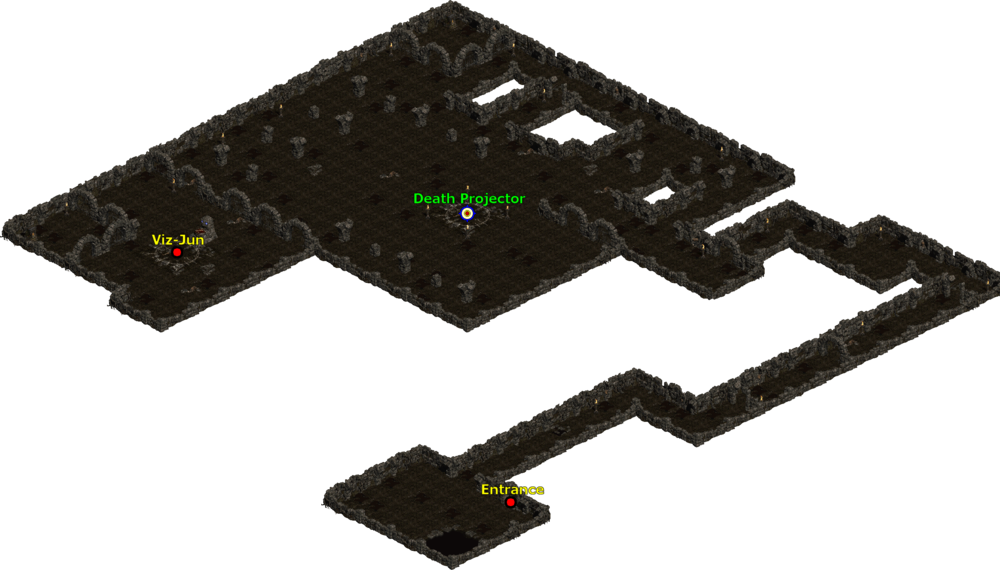
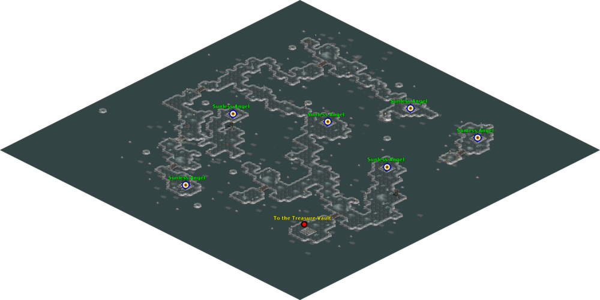

# 105 等超級任務

## 屠夫

地獄難度 A1  
救凱恩的紅門進去  
詳細入口如圖  
入口會鎖定

屠夫的牙齒  
留在物品欄有較多的額外好處  
需求等級: 105  
+10 所有屬性  
20% 打寶率  
+1 照亮範圍

## 入侵者

第二章進入皇宮往下走  
會看到一個灰袍的人  
不久他會開一個紅門  
入口會鎖定

裂縫漫遊者的眼睛  
需求等級: 105  
留在物品欄有較多的額外好處  
+1 全等級  
+15% 經驗值取得

## 地獄機器

地獄難度 A1  
泰摩高地的洞穴

王在 2 的位置

光學檢測器  
留在物品欄有較多的額外好處  
需求等級: 105  
解鎖專精技能 - 韌性

+5% 招喚物抗性  
元素抗性 +(11 to 15)%

## 死亡投射器

地獄難度 A3  
剝皮森林傳點旁的地窖第二層

雷射對焦水晶  
留在物品欄有較多的額外好處  
需求等級: 105  
提高最大生命 3%  
提高最大法力 10%  
+(6 to 10)% 經驗值獲得

## 無光島

地獄難度 A2  
城鎮一出去碎石荒地上的地窖  
進去之後的第二層  
打死小王會出現一個紅門

打死王一定掉落一個袋子  
還有一定機率會掉落一隻金鳥  
收集六個袋子合成  
然後再跟金鳥合成  

六天使包裹  
留在物品欄有較多的額外好處  
需求等級: 105  
＋(3 ~ 5)固有元素傷害  
抗火 +(21 to 25)%  
抗電 +(21 to 25)%  
抗冰 +(21 to 25)%  
-(2 to 5)% 敵人元素抗性  
3% 機率出現壓碎性打擊  
+(-3 to 5) 照亮範圍
