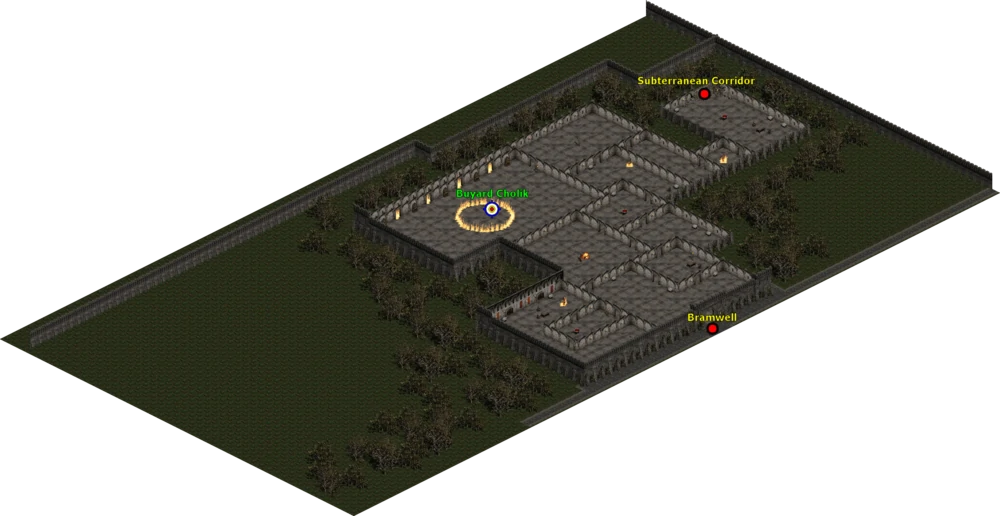
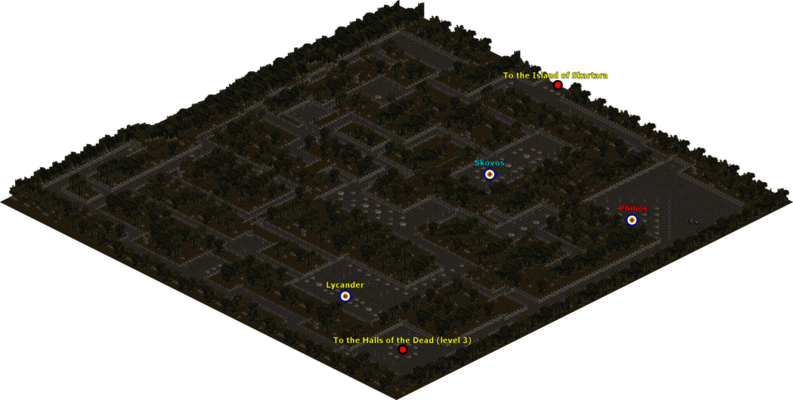
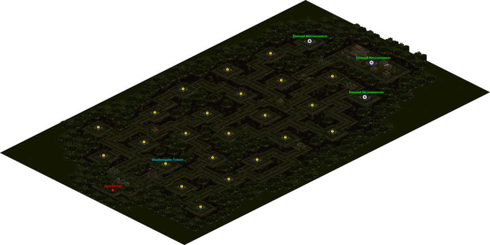
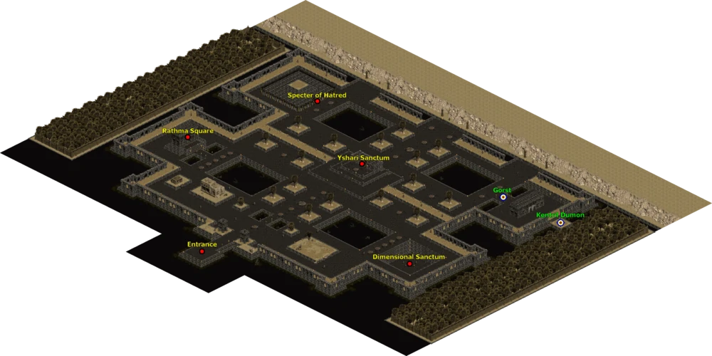
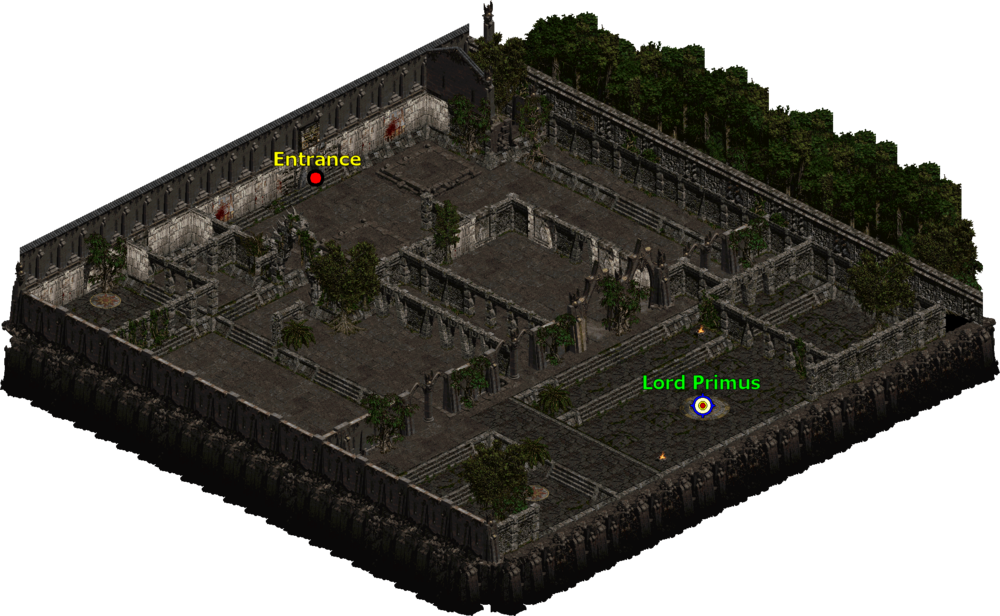
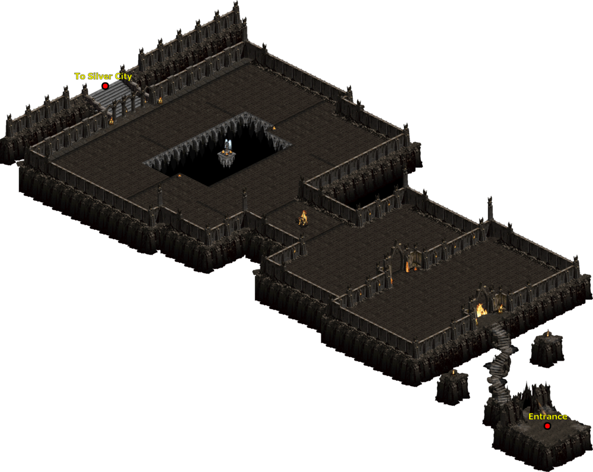
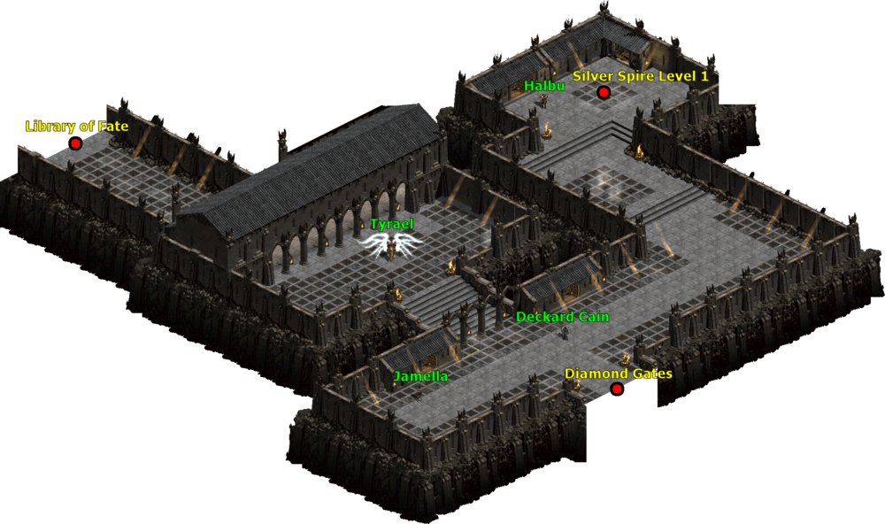
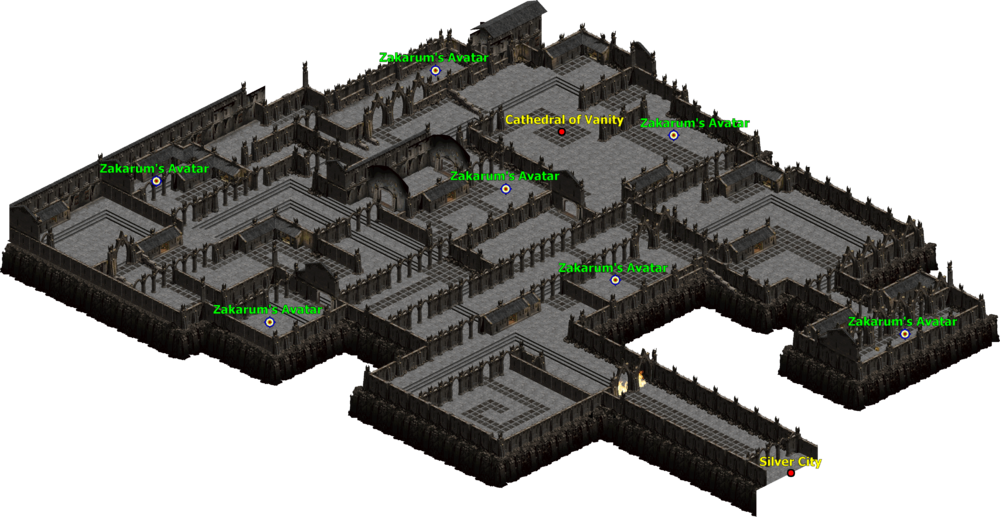
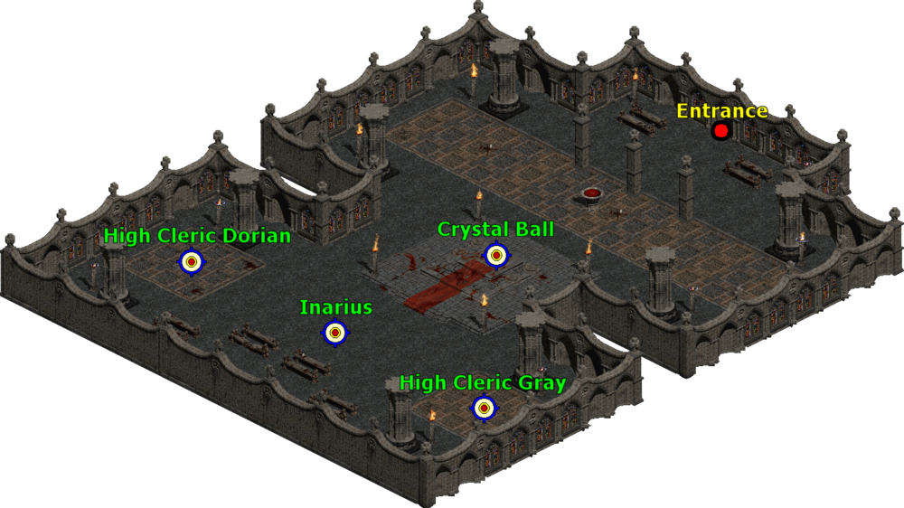
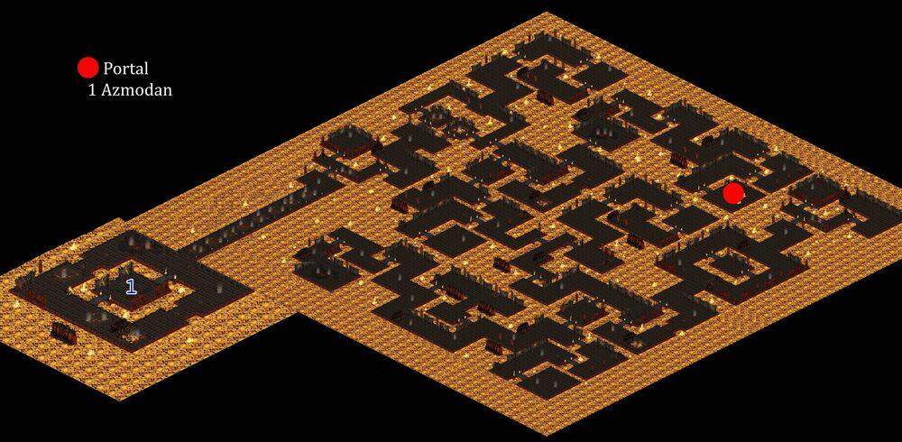

# 115 等超級任務

## 黑魔道

地獄難度 A1  
城鎮左下角馬車  
滑鼠稍微亂移一下  
出現文字就是了
王 Buyard Cholik 在綠色文字的位置

黑魔道  
留在物品欄有較多的額外好處  
需求等級: 115  
解鎖你的黑暗到技能  
+150 生命  
+75 法力

## 羅迪歐王子

地獄難度 A1  
牛關打死母牛王  
掉落維特的另外一條腿  
在牛關裡面放到盒子合成  
就會出現另外一個紅門

愚者金幣  
留在物品欄有較多的額外好處  
需求等級: 115  
+(0 to 38)力量  
+(0 to 38)敏捷  
+(0 to 38)體力  
+(0 to 38)能量  
總角色防禦+(11 to 15)%  
-10%金幣獲取率  
+(16 to 20)%打寶率

## 阿圖魯阿城

地獄難度 A2  
死亡之殿第三層  
小地圖上有個寶箱圖示  
打死那邊的小王就會出現紅門
進去之後地圖左手邊走到底有傳點

殺死三隻王  
拿到三顆石頭合成  
就會有諸神的太陽石

右上角有一個史卡塔拉島傳點，記得踩

諸神的太陽石  
留在物品欄有較多的額外好處  
需求等級: 115  
+(3~5)%固定元素傷害  
提高最大生命 (3 to 5)%生命  
提高最大生命 (11 to 15)%法力

王有 4%機率掉落獎盃碎片  
3 個碎片可以合成獎杯  
獎盃跟護符合成可以增加  
5%物理抗性

另外王也有 16%機率會掉落阿斯卡利的呼喊  
那是招喚 120 雅馬王用的物品

## k3000

地獄難度 A3  
拖拉陽叢林左上角  
小王有 1/3 機率會掉落護符  
k3000 有比較高機率  
會掉落符文、珠寶、寶石、祭壇跟綠色套裝

塔安判官之錘  
留在物品欄有較多的額外好處  
需求等級: 115  
+(21 - 25) 法術專精
+1 所有技能  
+1 死靈技能  
增強武器傷害(每等級多 0.1875)%

## 血魔甲

地獄難度 A3  
拖拉陽叢林右下角  
有時間鎖定

血魔甲  
留在物品欄有較多的額外好處  
需求等級: 115  
解鎖專精技能 - 耐力
+(3 to 5)%生命於擊中時偷取  
+(3 to 5)%法力於擊中時偷取

王有 6%機率掉落獎盃碎片  
3 個碎片可以合成獎杯  
獎盃跟護符合成可以增加  
總角色防禦+20%

## 拉斯瑪廣場

地獄難度 A3  
卡爾蒂姆左邊叫 Rathma Square 的地方

靈魂出竅的藥草  
留在物品欄有較多的額外好處  
需求等級: 115  
10%施法速度  
10%攻擊速度  
(21 to 150)%額外攻擊準確率加成  
(2 to 4)每秒生命回復

## 薩卡蘭姆的耳朵

地獄難度 A4  
打死 A4 的依卒爾會出現一個紅門  
進去之後會先到鑽石之門  
再往上走會到銀光之城  
他有傳點要記得踩  
在往上走會到命運文庫  
就是圖中 Library of Fate 的位置
天使有 1/6 的機率會掉護符

### 鑽石之門

### 銀光之城

### 命運文庫

薩卡蘭姆的耳朵  
留在物品欄有較多的額外好處  
需求等級: 115  
+(6 to 10)% 所有屬性  
+(6 to 15)% 經驗值取得

## 虛榮神像

地獄難度 A4  
在上一張命運文庫的地圖  
右上角有一個 Cathedral of Vanity  
那邊有一個紅門  
進去就是王的位置了

虛榮神像  
留在物品欄有較多的額外好處  
需求等級: 115  
解鎖專精 - 連續
+15%作戰速度

有 6%機率會掉獎盃碎片  
獎盃跟護符合成會有以下屬性獎勵  
+20%招喚物生命  
+10%招喚物抗性

## 阿茲莫丹之心

地獄難度 A4  
打死混沌避難所右邊封印的王剛姆  
會掉落邪惡之鑰  
滑鼠右鍵點他  
會開啟另外一個紅門到罪惡之境  
阿茲莫丹在最左下角

阿茲莫丹之心  
留在物品欄有較多的額外好處  
需求等級: 115  
最大元素抗性 +2%  
元素抗性 + (11 to 20)%  
-5%所有商人價格

有 6%機率會掉獎盃碎片  
獎盃跟護符合成會有以下屬性獎勵  
+150 生命  
+75 法力

## 入侵者 II

阿茲莫丹紅門右上角

打死王之後  
裂縫漫遊者的眼睛放到盒子合成  
+1 全技能

殺死王沒有受到裂縫風暴的傷害, 增加獎勵  
增加最大血量跟法量 2%

#### 獎勵任務 II (合成護符去完成)

擊敗 Ascendant 裂縫漫遊者(在 SCOSGLEN 裡面)

- 至少一個 Frozen Shambler 存活
- 沒有受到裂縫風暴的傷害
