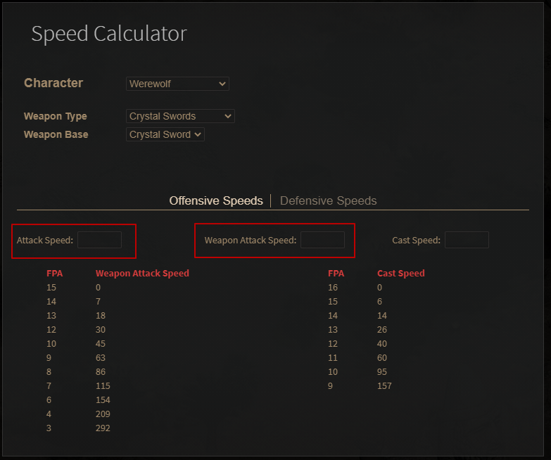
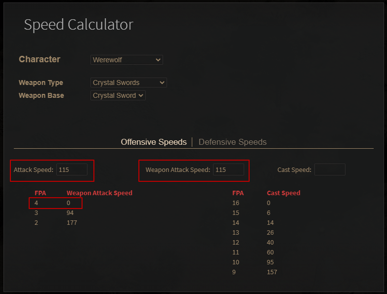

# 變熊/狼攻速如何計算

<SpeedTable/>

先連到[攻速器網址](https://dev.median-xl.com/speedcalc/)
選好了角色跟武器之後
左邊的 attack speed 指的是`武器上`的攻速
(不包含其他防具或是護符給的攻速)
右邊的 weapon attack speed 指的是所有攻速總合
不過不是重點, 兩邊數字請填一樣
變身系的攻速幾乎只看武器上的

如下面這張圖
攻速就是 4F
4 的右邊數字剛好是 0
那左邊數字到底填入多少好
看上面第一張圖右邊的數字
填那幾組數字去嘗試就對了

