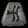
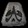
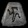

# 符文

## 一般符文

| 圖示                             | 編號 | 名稱  | 需求等級 | 屬性                                                                               |
| -------------------------------- | ---- | ----- | -------- | ---------------------------------------------------------------------------------- |
|     | 1    | El    | 6        | 武器: +3 全狀態 防具:+3 全狀態 盾: +3 全狀態                               |
|    | 2    | Eld   | 8        | 武器: +5 最大傷害 防具:+3 最大傷害 盾: +3 最大傷害                         |
|    | 3    | Tir   | 10       | 武器: 3%火焰法術傷害 防具:3%火焰法術傷害 盾: 3%火焰法術傷害                |
|    | 4    | Nef   | 13       | 武器: 3%閃電法術傷害 防具:3%閃電法術傷害 盾: 3%閃電法術傷害                |
|    | 5    | Eth   | 15       | 武器: 3%冰冷法術傷害 防具:3%冰冷法術傷害 盾: 3%冰冷法術傷害                |
|    | 6    | Ith   | 18       | 武器: 3%毒素法術傷害 防具:3%毒素法術傷害 盾: 3%毒素法術傷害                |
|    | 7    | Tal   | 20       | 武器: 3%物理/魔法法術傷害 防具:3%物理/魔法法術傷害 盾: 3%物理/魔法法術傷害 |
|    | 8    | Ral   | 23       | 武器: 30%火焰抗性 防具:25%火焰抗性 盾: 25%火焰抗性                         |
|    | 9    | Ort   | 25       | 武器: 30%閃電抗性 防具:25%閃電抗性 盾: 25%閃電抗性                         |
|   | 10   | Thul  | 28       | 武器: 30%冰冷抗性 防具:25%冰冷抗性 盾: 25%冰冷抗性                         |
|    | 11   | Amn   | 30       | 武器: 30%毒素抗性 防具:25%毒素抗性 盾: 25%毒素抗性                         |
|    | 12   | Sol   | 33       | 武器: 60 法力 防具:40 法力 盾: 40 法力                                     |
|  | 13   | Shael | 35       | 武器: 15%毒素法術持續時間 防具:10%毒素法術持續時間 盾: 10%毒素法術持續時間 |
|    | 14   | Dol   | 38       | 武器: 10%招喚物生命 防具:10%招喚物生命 盾: 10%招喚物生命                   |
|    | 15   | Hel   | 40       | 武器: 10%招喚物傷害 防具:10%招喚物傷害 盾: 10%招喚物傷害                   |
|     | 16   | Io    | 43       | 武器: 10%招喚物命中率 防具:10%招喚物命中率 盾: 10%招喚物命中率             |
|    | 17   | Lum   | 45       | 武器: 10%招喚物抗性 防具:10%招喚物抗性 盾: 10%招喚物抗性                   |
|     | 18   | Ko    | 48       | 武器: 5%力量 防具 5%力量 盾: 5%力量                                        |
|    | 19   | Fal   | 50       | 武器: 5%敏捷 防具 5%敏捷 盾: 5%敏捷                                        |
|    | 20   | Lem   | 53       | 武器: 5%體力 防具 5%體力 盾: 5%體力                                        |
|    | 21   | Pul   | 55       | 武器: 5%能量 防具 5%能量 盾: 5%能量                                        |
|     | 22   | Um    | 58       | 武器: 10%全抗 防具 10%全抗 盾: 10%全抗                                     |
|    | 23   | Mal   | 60       | 武器: 3%全狀態 防具 3%全狀態 盾: 3%全狀態                                  |
|    | 24   | Ist   | 63       | 武器: 10%打寶率 防具 7%打寶率 盾: 7%打寶率                                 |
|    | 25   | Gul   | 65       | 武器: 15%攻速 防具 15%攻速 盾:15%攻速                                      |
|    | 26   | Vex   | 68       | 武器: 15%施法速度 防具 15%施法速度 盾:15%施法速度                          |
|    | 27   | Ohm   | 70       | 武器: 15%打擊恢復 防具 15%打擊恢復 盾:15%打擊恢復                          |
|     | 28   | Lo    | 73       | 武器: 15%檔格速度 防具 15%檔格速度 盾:15%檔格速度                          |
|    | 29   | Sur   | 75       | 武器: 15%恢復法力速度 防具 5%恢復法力速度 盾:5%恢復法力速度                |
|    | 30   | Ber   | 78       | 武器: 3%緩慢怪物 防具: 2%緩慢攻擊者 盾:2%緩慢攻擊者                        |
|    | 31   | Jah   | 80       | 武器: 15%增強傷害 防具: 15%增強防禦 盾:15%增強防禦                         |
|   | 32   | Cham  | 83       | 武器: 3%最大法力值 防具:2%最大法力值 盾 2%最大法力值                       |
|    | 33   | Zod   | 85       | 武器: 無法破壞 防具:無法破壞 盾無法破壞                                    |

## 強化符文
