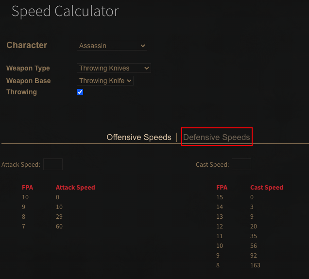

# 攻速器

## 如何使用

打開官方的[攻速器](https://dev.median-xl.com/speedcalc/)網頁

Character 選你要算的職業  
Weapon Type 選武器種類  
Ｗ eapon Base 選武器原型  
因為是丟飛刀  
所以把 Throwing(丟躑) 也選起來

下面出現的表就是門檻了  
如圖，總共需要 60 攻速到達極速  
超過 60%的攻速都沒用  
同理，施法速度就是 163%  
點一下 Defensive Speeds  
就能看打擊恢復跟格擋恢復的門檻

## 屬性解釋

#### 打擊恢復

受到超過最大血量 1/12 的傷害  
就會進入短暫不能做任何動作的動畫  
計速器算出來的 frame 數  
就是恢復正常所花的 frame 數(1 秒 25f)

#### 格檔恢復

跟打擊恢復一樣  
只是觸發條件是格檔發生時  
假如格檔很高  
但是格檔恢復沒有稱  
也是容易被釘在原地

#### 過門檻

這遊戲是 1 秒 25 張(frame)圖去顯示畫面的  
因為沒有 3.5F 這種張數的速度  
都是整數的  
所以速度要過門檻才有作用

例如:  
8f 29%ias  
7f 60%ias  
假如速度稱到 40%  
過了 29%不到 60%  
效果跟 29%的一樣  
多稱的 11%就浪費了
