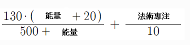
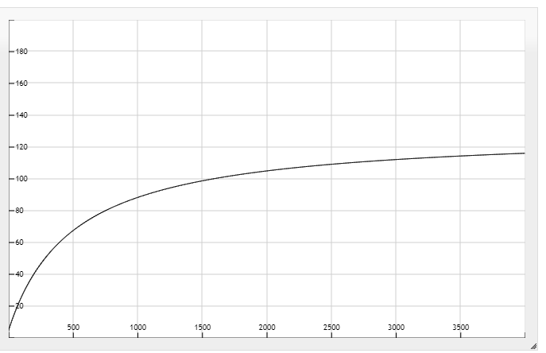

# 法術傷害詳解

## 法術傷害計算

總法術傷害(TD) = 法術基礎傷害(BD) \* 法術傷害(SD) \* 法術協同傷害(SF)

BD 就是技能本身的基礎傷害，跟`技能等級`還有`角色等級`有關，所以練等也很重要  
SD 就是裝備、護符還有技能加成的法術傷害總和  
SF 計算公式如下:

法術專注最多 1000，超過的沒用  
能量的曲線圖如下:  

#### 以下技能傷害加成被算在 SF 那一類

- 亞馬的 Bachanallia
- 法師的巫師之血

## 降抗相關

| 對象                                         | 降抗需求 |
| -------------------------------------------- | -------- |
| 一般怪                                       | -135%    |
| 阿斯特洛伽跟屋迪 (ASTROGHA 跟 Uldyssian) | -160%    |
| 其他任務的王                                 | -170%    |
| 德莫斯 (deimoss)                         | -190%    |
| 小精靈 (anomaly)                         | -190%    |
| 薩繆爾跟大恐龍 (samuel 跟 phoboss)       | -199%    |
